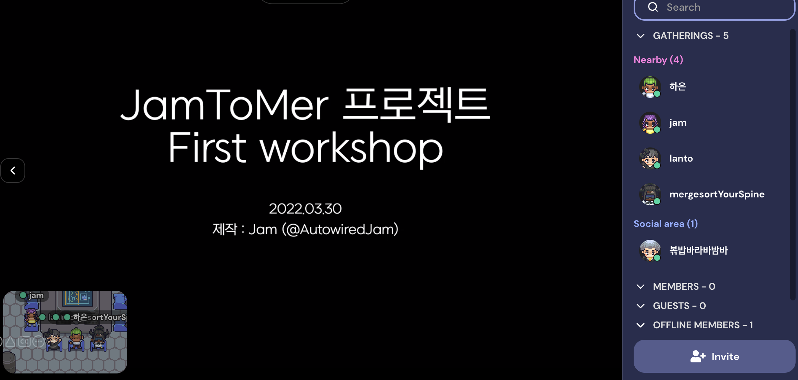
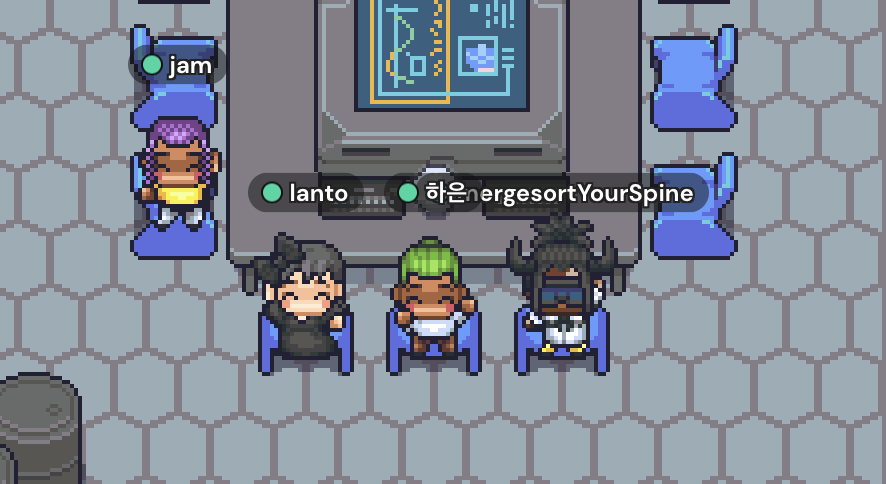

# 3월

## 22: 운영체제 스터디가 끝났다. 

스터디 방식은 한 챕터씩 강의를 듣고 각자의 방식으로 정리한 뒤, 매주 수,일요일 저녁 9시에 줌에서 이야기를 하는 것이었다. 각자 돌아가면서 인상깊었던 것과 생각을 말하고 퀴즈를 내고 함께 풀었다.

시간이 남으면 수다를 떨었는데 나뺴고 다 백엔드개발자셨다. 덕분에 백엔드 기술 이야기를 많이 들었다. 스터디하면서 리눅스 코드에서 세마포어를 어떻게 구현했는지 보기도 하고... 깃허브로 남의 코드를 보는 재미를 알게 되었다. ㅋㅋㅋ 

## 28: 약 35일간 체지방 2.5kg 뺐다. 

일련의 기준을 충족하는(새벽오픈, 집에서 가까울것, 인클라인 기능 있는 트레드밀이 있을것) 헬스를 등록해서 자주 다녔다. 다행히 근육은 0.2kg만 빠졌다. 근력운동을 유산소보다 더 많이 했는데 ㅎㅎ 역시 체지방 빼는 것보다 근육 늘리는게 더 어렵구나! 더 건강해지자 아좌아좍

## 29: 나는 그냥 새로운 걸 좋아하는 것 같다. 

새로운 음식 먹어보기, 새로운 나라 여행하기, 새로운 사람 만나기... 모든 인간과 음식, 나라, 물건이 새로운 이야기를 가지고 있고 그런 이야기(& 의견)을 알게되는건 정말 즐거운 일이다. 결국 내 사고의 확장으로도 이어진다.

## 31: 뷰프레스로 노트를 만들다.

vuepress는 내가 원하던 그것이다. 만들기 쉬울 뿐더러 사이드바가 있어서 보기 편하고 검색, 헤딩별 네비게이션 등등... 아주 만족스럽다. 간단한 메모를 적고 싶은데 이걸 TIL이나 블로그에 넣고 싶진 않았어서 고민을 많이 했었는데 가슴 한켠이 시원해졌다. 씁하~🍃

## 31: 'MessageToMe'팀 첫 워크샵

게더타운에서 MessageToMe 팀 첫 워크샵을 했다. 프로젝트를 하면서 회의는 자주 했지만 실제로 얼굴을 드러내고 사적인 이야기를 한 건 처음이었다. 