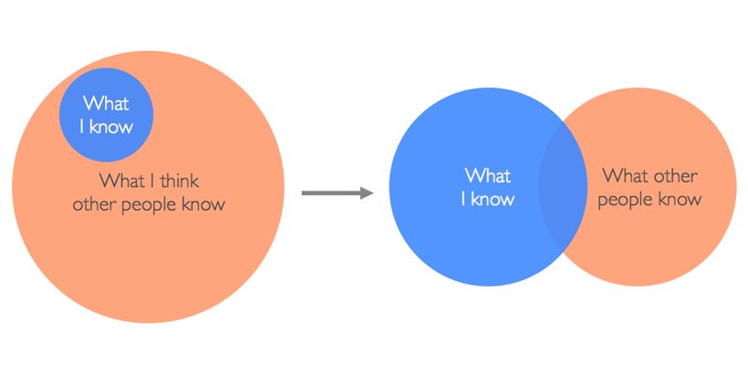
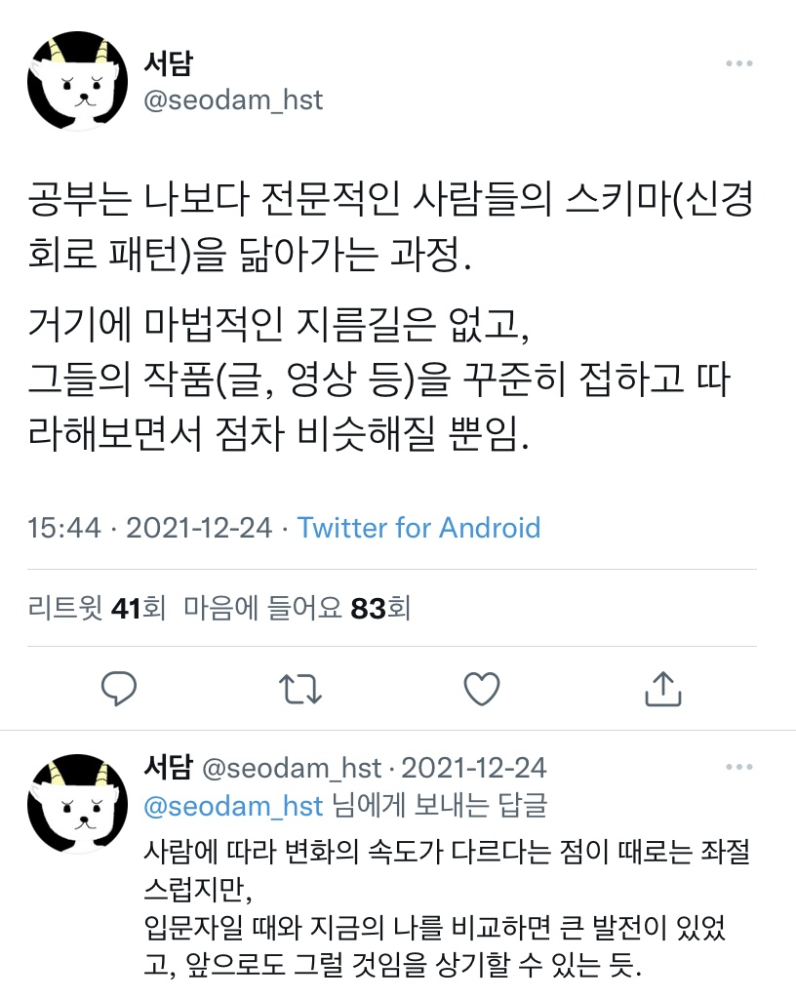

# 4월

## 1st April Fool's day

아침에 에러 고치러 스택오버플로 들어갔는데 이렇게 보였다...!!! ㅋㅋ 만우절이라 그런 것 같았다. 해결방법 찾으려고 화면 뚫어져라 보다가 가뜩이나 안 좋은 시력 더 나빠질뻔... 보니까 테마가 추가돼서 저런 어지러운 테마부터 페이스북 느낌, 터미널 느낌까지 다양했다. 

+ 아 오늘부터 1일1JS 이론 공부 시작했다.

## 6th metacognition

개발자가 되고 다른 사람들의 지식에 감탄하면서 쭈구리 모드가 되곤 했는데, 힘이 되는 다이어그램이다. 개발자로 커리어를 시작한 이후로는 (물론 내 첫 **직업**이 개발자지만 ㅋㅋㅋ) 공부를 어떻게 할 것인가를 자주 고민하고 있다. 배우고 싶은+배워야할 게 많아서 그런 것 같다. 공부 방법과 방향 감각을 잃지 않아야한다.

친구가 보내준 이 트윗도 좋아한다. **공부는 나보다 전문적인 사람들의 스키마(신경회로 패턴)을 닮아가는** 과정. **마법적인 지름길은 없고,** 꾸준히 접하고 따라해보면서 점차 비슷해지는 것이다!

그래서 예전엔 재미있어보이는&흥미로운 아티클들만 읽었다면 요즘은 시간을 내서 읽는 중이다. 