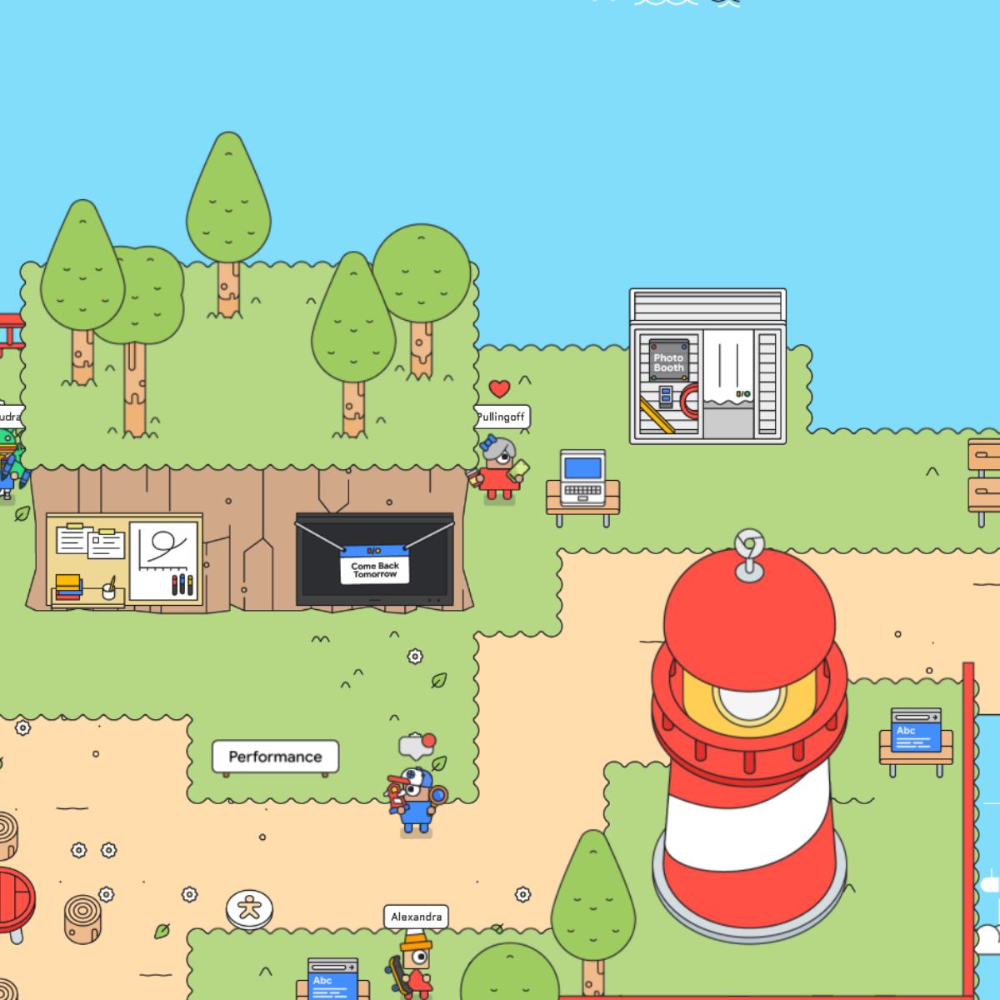
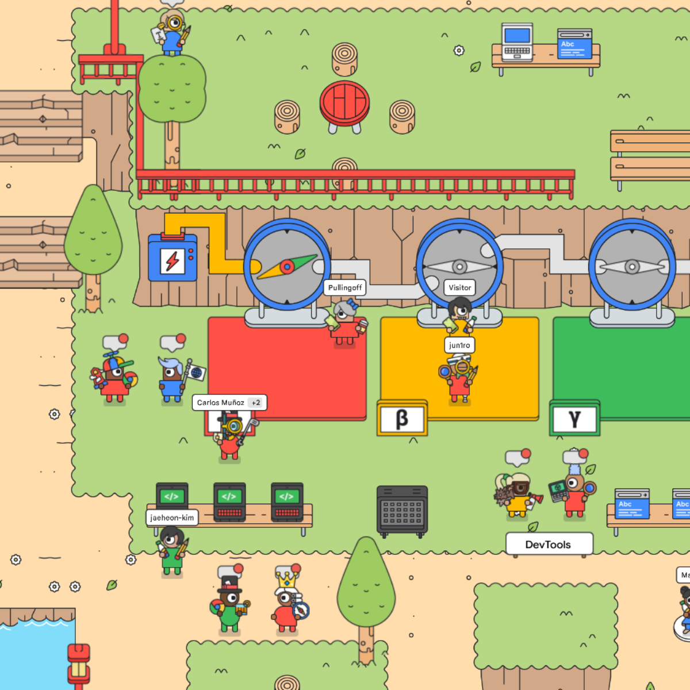
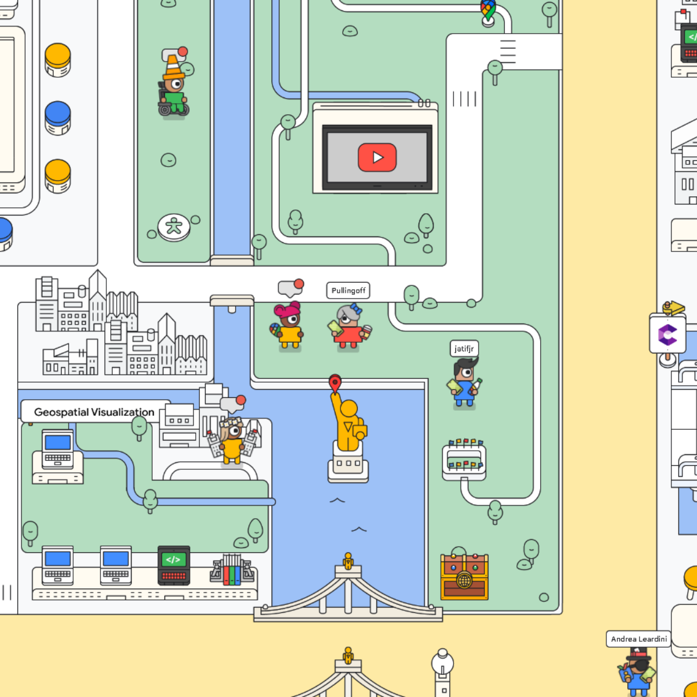
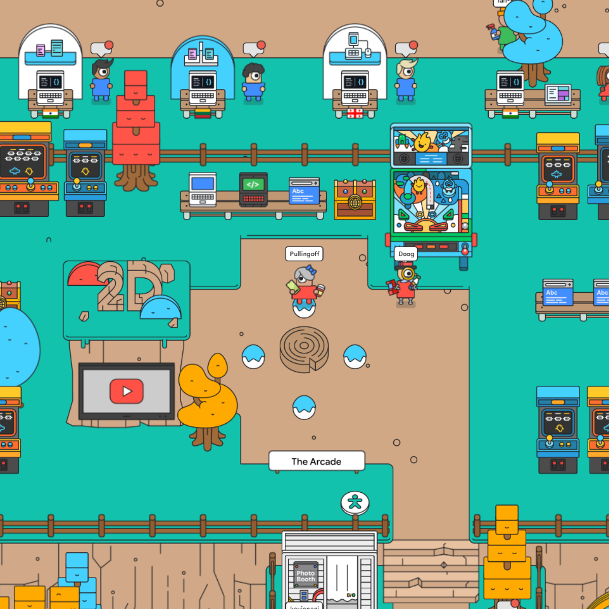
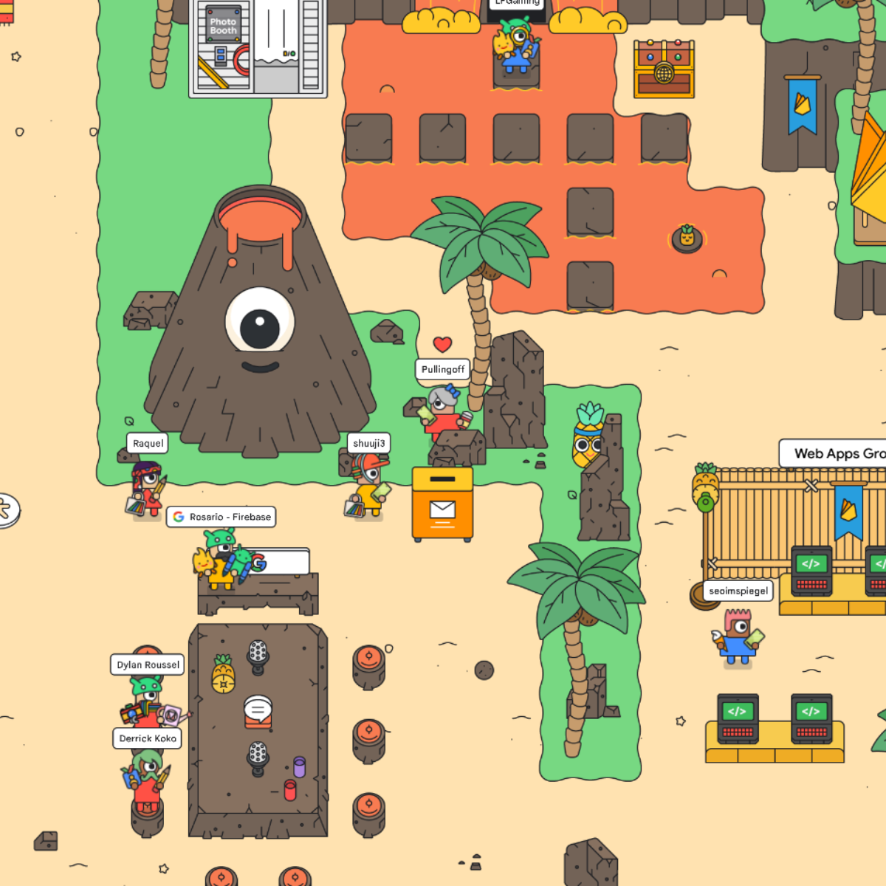
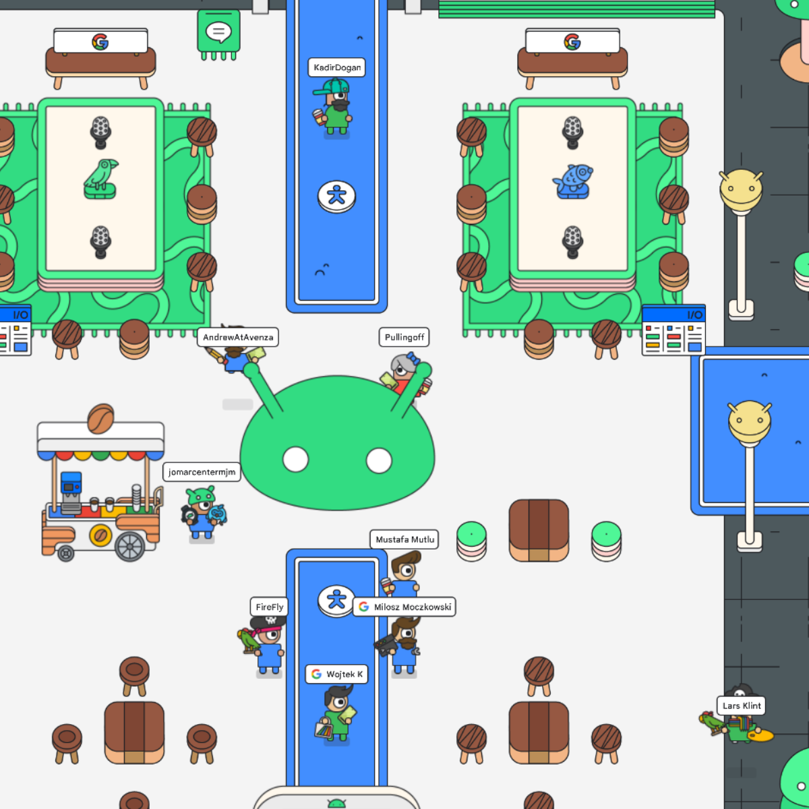
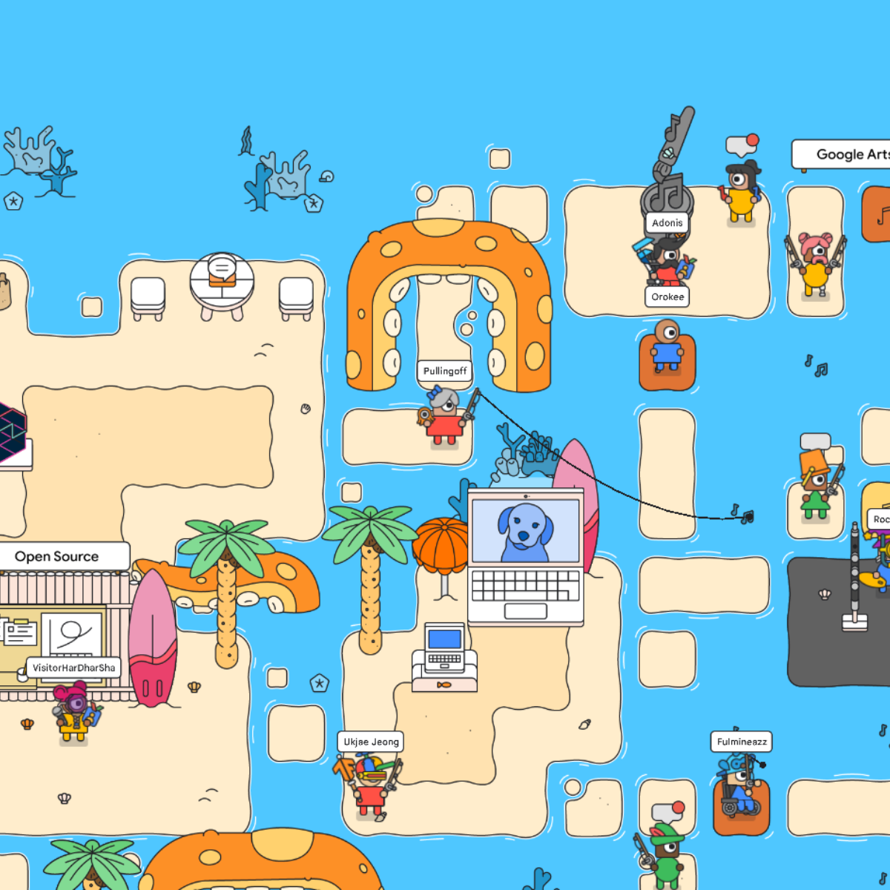
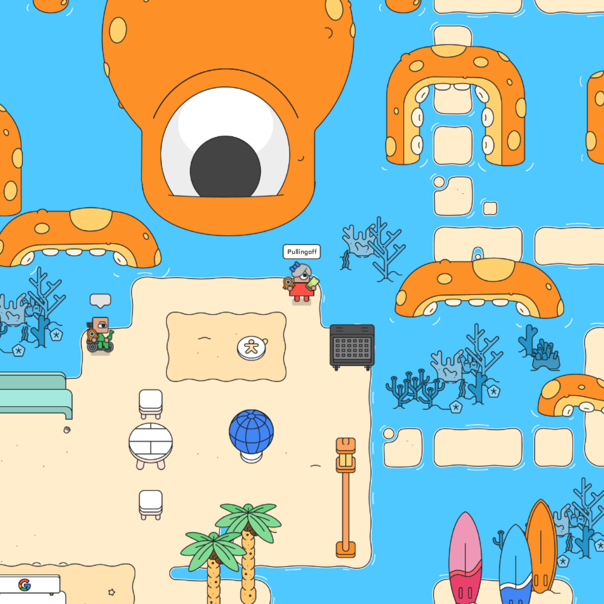

# 5월

## GDB는 진짜 오래 걸린다(?)

회사에서 neo4j 를 사용해 GDB를 구축하는 업무를 맡고 있다.
근데 GDB는 진짜 오래 걸린다. 엣지(관계)를 연결할 때엔 쿼리로 노드를 검색해서 그 노드가 있으면 연결을 하는데, (이 전제가 없으면 없는 노드를 바로 생성해 연결한다.) 그 검색이 진짜 오래 걸린다. 노드 수가 늘어날 수록 검색 속도는 더 느려지고... 요즘엔 1초에 엣지 하나를 생성하는 수준이다. 엣지 3만개를 넣는다고 하면, 약 3만초가 걸리는 셈이다...

노드1과 노드2를 잇는 관계 생성 쿼리의 경우 노드1이 없으면 그 쿼리는 사실상 무용지물이 된다. 그래서 원래는 DB 결과를 바로 GDB 쿼리로 만들었는데, 두 노드 중 하나라도 없진 않은지 미리 확인하고, 하나라도 없으면 그 쿼리를 생략(break)하도록 로직을 추가하려고 한다. 

구체적인 방법은 생각하지 않았지만... ㅋㅋㅋ   
컴퓨터가 느린 경우도 있구나 싶다. 

## 송은 / 미술관을 다녀와서

송은 미술관에 다녀왔다. 도산대로 한복판에 자리잡고 있는 거대한 비영리 문화공간. 이게 진정한 FLEX라고 생각한다. 주말에 갔는데도 한적했던 송은 미술관! 트여있는 창과 높은 층고 덕분에 한숨 돌렸다.

UI/UX 디자인을 할때 국내외 미술관 사이트를 많이 참고하는데, 하나같이 감각적이거나 깔끔하면서도 개성 있어서이다. 따라하고 싶어도 따라하기 정말 어려운 것들... ㅋㅋㅋ

전시 도록들을 보면 엄청 작은 글씨로 A4 한장에 빽빽히 들어차있는 경우가 많다. 빳빳한 종이 말고 평범하게 얇은 A4가 주는 그 감성이 좋다.ㅋㅋㅋ `margin`과 `padding`이 적게 들어가 있는 것도 좋다.

송은 아트센터의 경우 길쭉네모네모한 폰트를 쓰고 있었는데, 세련됐으면서도 정갈해서 언젠가 웹사이트 디자인할 때 써보고 싶었다.

## Google IO 2022 구경

Google IO 2022가 열렸다.   

웹, 플러터, 안드로이드 등등 여러 분야를 게더타운처럼 탐험하면서 구경할 수 있었다.   
구글 맵존도 있었는데, 웹이랑 구글 맵 쪽이 제일 흥미로웠다 ㅋㅋㅋ   
낚시대도 던질수 있고 귀여운게 많아서.. 기술에 집중을 못했네 허허   

귀여운 사진 막 뿌리고 가기!!!

