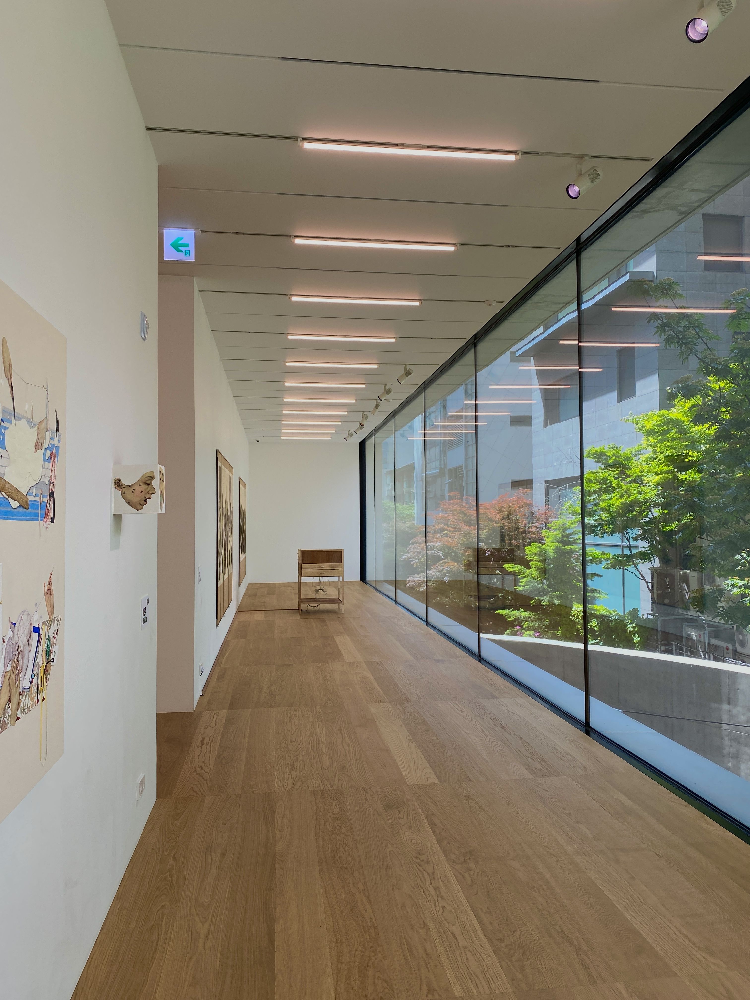
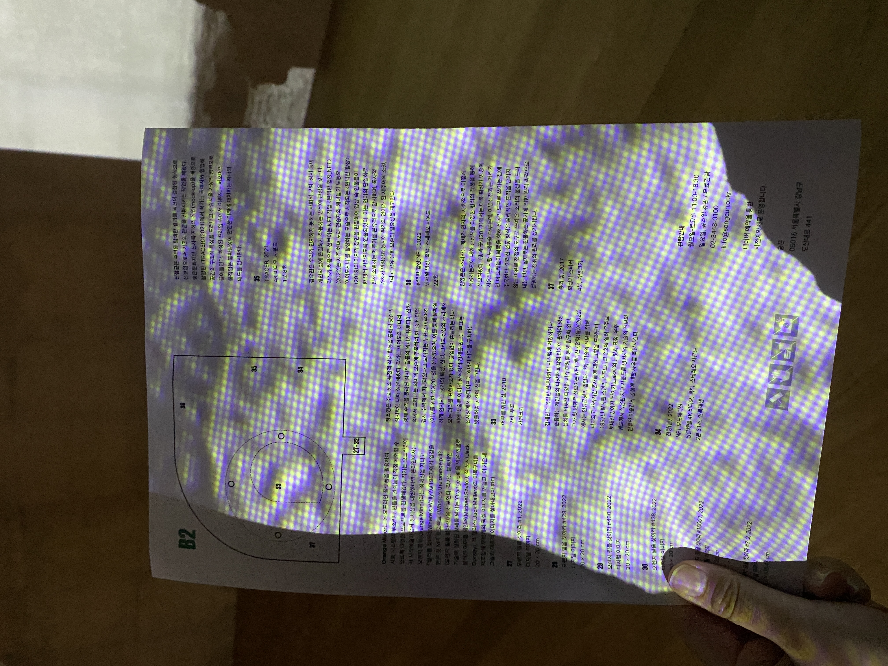
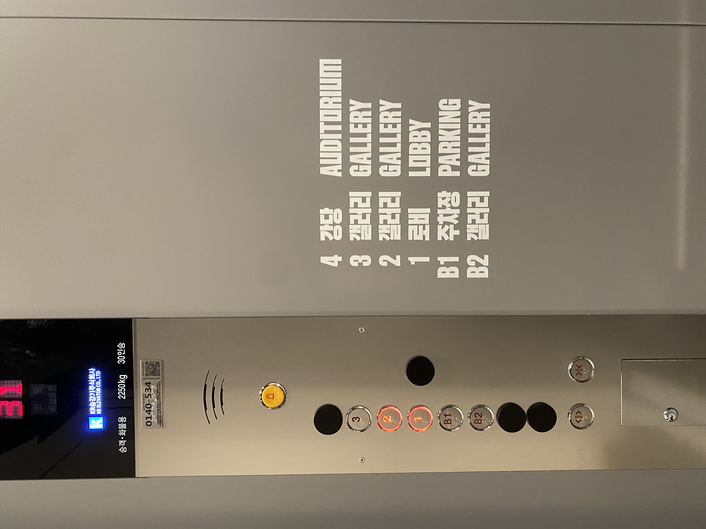

# 5월

## 송은 / 미술관을 다녀와서

송은 미술관에 다녀왔다. 도산대로 한복판에 자리잡고 있는 거대한 비영리 문화공간. 이게 진정한 FLEX라고 생각한다. 주말에 갔는데도 한적했던 송은 미술관! 트여있는 창과 높은 층고 덕분에 한숨 돌렸다.

UI/UX 디자인을 할때 국내외 미술관 사이트를 많이 참고하는데, 하나같이 감각적이거나 깔끔하면서도 개성 있어서이다. 따라하고 싶어도 따라하기 정말 어려운 것들... ㅋㅋㅋ

전시 도록들을 보면 엄청 작은 글씨로 A4 한장에 빽빽히 들어차있는 경우가 많다. 빳빳한 종이 말고 평범하게 얇은 A4가 주는 그 감성이 좋다.ㅋㅋㅋ `margin`과 `padding`이 적게 들어가 있는 것도 좋다.

송은 아트센터의 경우 길쭉네모네모한 폰트를 쓰고 있었는데, 세련됐으면서도 정갈해서 언젠가 웹사이트 디자인할 때 써보고 싶었다.

